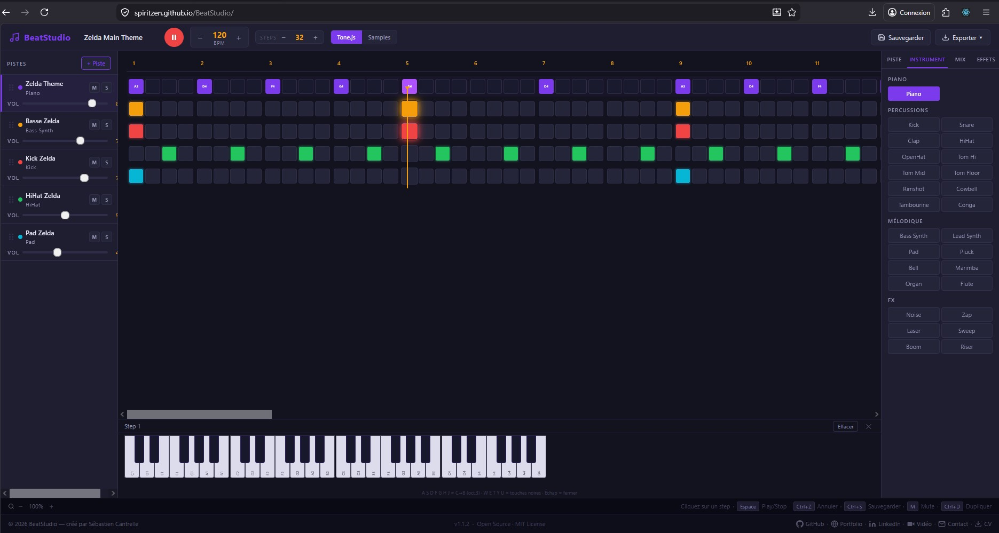

<div align="center">



# 🎛️ BeatStudio

### Step sequencer professionnel open source
**Créer · Composer · Exporter · Partager**

[](https://spiritzen.github.io/BeatStudio/)
[](https://github.com/Spiritzen)
[](https://spiritzen.github.io/portfolio/)
[](https://www.linkedin.com/in/sebastien-cantrelle-26b695106/)

---

> **BeatStudio** est un step sequencer professionnel open source,
> inspiré de FL Studio, 100% front-end, zéro serveur, déployé sur GitHub Pages.
> Conçu pour composer, expérimenter et exporter des patterns rythmiques directement dans le navigateur.

---

</div>

## 🌍 Demo live

### 👉 [https://spiritzen.github.io/BeatStudio/](https://spiritzen.github.io/BeatStudio/)

---

## ✨ Pourquoi BeatStudio ?

| Besoin | BeatStudio |
|--------|------------|
| Composer un beat sans installation | ✅ 100% navigateur, zéro plugin |
| Avoir des vrais sons de batterie | ✅ 26 instruments synthétiques Tone.js |
| Utiliser ses propres samples | ✅ Import .wav / .mp3 / .ogg par piste |
| Appliquer des effets audio | ✅ Reverb · Delay · Distortion · Filter par piste |
| Sauvegarder et reprendre son travail | ✅ Export JSON + sauvegarde localStorage |
| Exporter un fichier audio | ✅ Export WAV réel via MediaRecorder (son identique à la lecture) |
| Travailler sans connexion | ✅ 100% local, zéro API obligatoire |

---

## 🚀 Fonctionnalités

### 🎛️ Séquenceur
- Grille de steps globale — **8 à 256 steps**, snap au multiple de 4
- **8 pistes** par défaut, nombre illimité ajoutables
- **29 instruments** synthétiques organisés en 3 catégories
- Playhead animé synchronisé avec `Tone.Transport`
- BPM réglable en temps réel — 40 à 240 BPM
- Boucle automatique infinie
- **Zoom grille** de 50% à 200% — vue d'ensemble ou détail
- **Piano virtuel** 4 octaves (C1 → B4) — assignation de notes par step
- **Preview sonore** au clic sur chaque instrument
- **Prefabs** — patterns prédéfinis chargeables en un clic

### 🎹 Instruments — 29 sons synthétiques

**Mélodique** (avec clavier de notes 4 octaves)
`Piano` · `Bass Synth` · `Lead Synth` · `Pad` · `Pluck` · `Bell`
`Marimba` · `Organ` · `Flute` · `Guitare Acoustique` · `Guitare Électrique` · `Lyre`

**Percussions**
`Kick` · `Snare` · `Clap` · `HiHat` · `OpenHat` · `Tom Hi` · `Tom Mid` · `Tom Floor` · `Rimshot` · `Cowbell` · `Tambourine` · `Conga`

**FX**
`Noise` · `Zap` · `Laser` · `Sweep` · `Boom` · `Riser`

### 🔊 Audio
- Moteur **Tone.js** — timing précis via `Tone.Transport`
- Switch **Tone.js / Samples** — basculer entre synth et fichiers audio
- Import de samples personnalisés par piste (`.wav` · `.mp3` · `.ogg`)
- **Mute / Solo** par piste
- **Volume** individuel par piste
- **Pan** gauche/droite par piste

### 🎚️ Effets par piste
- **Reverb** — `Tone.Reverb` avec contrôle d'intensité
- **Delay** — `Tone.FeedbackDelay` avec contrôle d'intensité
- **Distortion** — `Tone.Distortion` avec contrôle d'intensité
- **Filter** — `Tone.Filter` HP/LP avec fréquence réglable

### 💾 Sauvegarde & Export
- **Sauvegarde localStorage** — auto-save debounce 500ms
- **Pattern par défaut** — chargé automatiquement au premier lancement
- **Export JSON** — pattern complet incluant les effets par piste
- **Import JSON** — chargement fidèle pistes + effets
- **Bouton Charger** — import JSON depuis la TopBar avec confirmation
- **Prefabs** — bibliothèque de patterns prédéfinis (Default · Zelda Theme · Jingle Bells Rock)
- **Export WAV réel** — capture MediaRecorder → encodage PCM 16bit
- **Copier pattern** — JSON dans le presse-papier

### 🖥️ Interface
- Layout **3 panneaux** — Pistes | Grille | Propriétés
- Style dark inspiré d'**EasyStudio**
- **Titre du pattern** éditable dans la TopBar
- **Footer 2 barres** — raccourcis clavier + liens auteur
- **Follow Playhead** — grille défile automatiquement, style DAW professionnel (Ableton / FL Studio)
- **Message mobile** — invitation à utiliser la version desktop
- Raccourcis clavier complets

---

## ⌨️ Raccourcis clavier

| Touche | Action |
|--------|--------|
| `Espace` | Play / Stop |
| `Ctrl+Z` | Annuler |
| `Ctrl+S` | Sauvegarder le pattern |
| `M` | Mute/unmute piste sélectionnée |
| `Ctrl+D` | Dupliquer la piste sélectionnée |
| `Suppr` | Effacer step sélectionné |

---

## 🛠 Stack technique

| Technologie | Rôle |
|-------------|------|
| React 18 | Interface composants |
| TypeScript | Typage strict |
| Vite | Build ultra-rapide |
| Tone.js v14 | Moteur audio Web Audio API |
| CSS Modules | Styles scopés par composant |
| GitHub Pages | Hébergement gratuit |
| GitHub Actions | CI/CD déploiement automatique |

---

## 🏗 Architecture

```
src/
├── components/
│   ├── TopBar.tsx               # Logo · Play · BPM · Steps · Mode · Export
│   ├── LeftPanel/
│   │   ├── LeftPanel.tsx        # Liste des pistes
│   │   ├── TrackItem.tsx        # Piste individuelle (M/S/Vol)
│   │   └── AddTrackModal.tsx    # Modal ajout d'instrument
│   ├── CenterGrid/
│   │   ├── CenterGrid.tsx       # Grille de steps + header beats
│   │   ├── StepCell.tsx         # Cellule individuelle
│   │   └── Playhead.tsx         # Indicateur de position
│   ├── RightPanel/
│   │   ├── RightPanel.tsx       # Onglets Piste/Instrument/Mix/Effets
│   │   ├── InstrumentPicker.tsx # Sélecteur des 26 instruments
│   │   ├── FxSection.tsx        # Effets audio par piste
│   │   └── SampleLoader.tsx     # Import sample .wav/.mp3
│   └── Footer.tsx               # 2 barres : raccourcis + liens auteur
├── hooks/
│   ├── useSequencer.ts          # Moteur Tone.Transport + Sequence
│   ├── usePattern.ts            # État global + globalSteps + resize
│   └── useExport.ts             # JSON · WAV · Clipboard
├── utils/
│   ├── synths.ts                # 26 synthétiseurs Tone.js
│   ├── effects.ts               # Chaîne d'effets par piste
│   ├── encodeWav.ts             # Encodeur WAV PCM 16bit
│   └── previewInstrument.ts     # Preview sonore au clic
├── types/
│   └── index.ts                 # Interfaces Pattern · Track · TrackFx
└── App.tsx
```

---

## ⚙️ Installation locale

```bash
git clone https://github.com/Spiritzen/BeatStudio.git
cd BeatStudio
npm install
npm run dev
```

➡️ Ouvrir **http://localhost:5173/BeatStudio/**

---

## 🚀 Déploiement GitHub Pages

```bash
npm run build
npm run deploy
```

➡️ **https://spiritzen.github.io/BeatStudio/**

Le déploiement est aussi **automatique via GitHub Actions** à chaque push sur `main`.

---

## 💾 Format de sauvegarde `.json`

Le pattern exporté est un fichier JSON lisible et portable, **effets inclus** :

```json
{
  "version": "1.0.0",
  "name": "default",
  "bpm": 120,
  "globalSteps": 32,
  "createdAt": "2026-01-01T00:00:00.000Z",
  "tracks": [
    {
      "id": 1,
      "name": "Kick",
      "inst": "Kick",
      "color": "#f59e0b",
      "vol": 0.85,
      "pan": 0,
      "mute": false,
      "solo": false,
      "pattern": [true, false, false, false, "..."],
      "fx": {
        "reverb": false,  "reverbAmt": 0.3,
        "delay":  false,  "delayAmt":  0.3,
        "dist":   false,  "distAmt":   0.3,
        "filter": false,  "filterFreq": 0.7,
        "filterType": "LP"
      }
    }
  ]
}
```

---

## 📋 Changelog

### v1.2.3 — Follow Playhead + Mobile message

- ✨ Follow Playhead — la grille défile automatiquement pendant la lecture, le playhead reste centré (style DAW pro)
- ✨ Début de lecture → grille fixe, playhead avance normalement
- ✨ Milieu → grille défile en douceur (requestAnimationFrame)
- ✨ Stop → retour smooth au début
- ✨ Message "Version desktop recommandée" sur mobile avec option "Continuer quand même"
- 🐛 Fix : suppression de la ligne verticale intrusive

### v1.2.2 — Instruments mélodiques + Clavier universel + Prefabs enrichis

- ✨ Clavier de notes étendu à tous les instruments mélodiques (Bass Synth · Lead Synth · Pad · Pluck · Bell · Marimba · Organ · Flute)
- ✨ 3 nouveaux instruments — Guitare Acoustique · Guitare Électrique · Lyre
- ✨ Piano déplacé dans la section Mélodique (UX cohérente)
- ✨ Preview clavier joue le son de l'instrument sélectionné (pas Piano générique)
- ✨ 1 nouveau prefab — Jingle Bells Rock
- 🐛 Fix : clavier virtuel preview utilisait toujours le son Piano
- 🐛 Fix : instruments mélodiques jouaient Piano au lieu de leur propre son

### v1.2.1 — Export WAV · Prefabs · Preview instruments · Charger

- ✨ Export WAV réel via MediaRecorder → PCM 16bit (Audacity · OBS · After Effects)
- ✨ Bouton Prefabs ▾ — patterns prédéfinis chargeables (Default · Zelda Theme)
- ✨ Bouton Charger standalone dans la TopBar (retiré du dropdown Exporter)
- ✨ Preview sonore au clic sur chaque instrument (InstrumentPicker + AddTrackModal)
- ✨ Volume synths augmenté +6dB sur tous les instruments
- 🐛 Fix collision preview/synth — sélection avant preview (setTimeout 100ms)

### v1.1.2 — Piano virtuel + Modale d'accueil
- ✨ Instrument Piano avec clavier virtuel 4 octaves (C1 → B4)
- ✨ Zone piano fixe en bas de la grille au clic sur un step
- ✨ Assignation de notes via clavier virtuel ou clavier physique (A-Z)
- ✨ Modale d'accueil — Démo / Nouveau projet / Ouvrir un projet
- 🐛 Fix sanitize pan value (must be within [-1, 1])

### v1.0.0 — Initial Release
- ✨ Step sequencer 8 pistes × 32 steps (longueur globale 8–256)
- ✨ 26 instruments synthétiques Tone.js (Percussions · Mélodique · FX)
- ✨ Switch Tone.js / Samples + import .wav/.mp3
- ✨ Effets par piste — Reverb · Delay · Distortion · Filter
- ✨ Export JSON pattern (effets inclus) + Import JSON
- ✨ Export WAV via Tone.Offline
- ✨ Pattern default.json chargé au premier lancement
- ✨ Titre du pattern éditable dans la TopBar
- ✨ Zoom grille 50%–200% dans le footer
- ✨ Footer 2 barres style EasyStudio avec liens auteur
- ✨ Raccourcis clavier (Espace · Ctrl+Z · Ctrl+S · M · Ctrl+D)
- ✨ Sauvegarde localStorage auto-save
- ✨ Déploiement GitHub Pages via gh-pages + GitHub Actions

---

## 🎯 Philosophie du projet

BeatStudio est né d'une envie simple :
**composer de la musique directement dans le navigateur, sans installation, sans compte, sans limite.**

- ✅ **Zéro serveur** — tout tourne en local dans le navigateur
- ✅ **Export réel** — JSON portable + WAV audio
- ✅ **Effets sérialisés** — le son est fidèlement restauré au rechargement
- ✅ **Open source** — forkez, adaptez, améliorez
- ✅ **Portfolio-ready** — Web Audio API + React + architecture propre

---

## 👤 Auteur

<div align="center">

### Sébastien Cantrelle
**Développeur Full Stack · DevOps Junior**
*Titre RNCP Niveau 6 — Concepteur Développeur d'Applications*
Amiens, France · Télétravail possible

[](https://spiritzen.github.io/portfolio/)
[](https://www.linkedin.com/in/sebastien-cantrelle-26b695106/)
[](https://github.com/Spiritzen)
[](https://www.youtube.com/watch?v=DVOQzauF8Es)
[](mailto:sebastien.cantrelle@hotmail.fr)
[](https://spiritzen.github.io/BeatStudio/images/CV_Sebastien_Cantrelle.pdf)

</div>

---

<div align="center">

**⭐ Si BeatStudio vous est utile, une étoile sur GitHub c'est toujours apprécié !**

*BeatStudio · MIT License · 2026*

</div>
